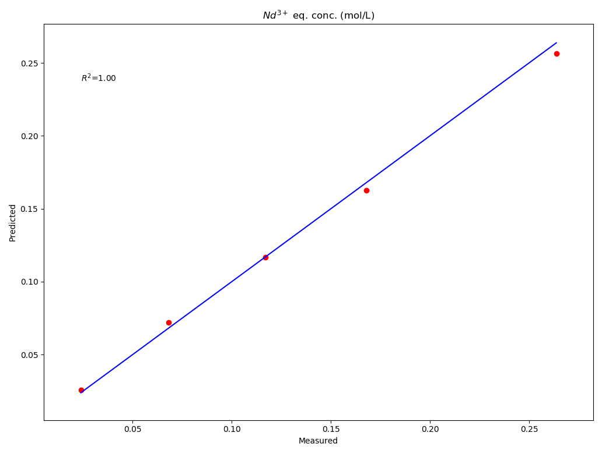

.. _quickstart:

***************
Getting Started
***************

Here is a quick example of how to fit an xml thermodynamic model to experimental data.

This code fits Nd standard enthalpy in the "twophase.xml" cantera file to the 
experimental data in "Nd_exp_data.csv".

This code requires that you copy and paste the "elementz.xml" file in the llepe's data folder into 
the Cantera's data folder located in your environments site-packages folder.

The code then produces a parity plot of the measured and predicted concentrations of Nd 3+ in the 
aqueous phase.

.. code-block:: python

	from llepe import LLEPE
	opt_dict = {'Nd(H(A)2)3(org)_h0': {'upper_element_name': 'species',
                              'upper_attrib_name': 'name',
                              'upper_attrib_value': 'Nd(H(A)2)3(org)',
                              'lower_element_name': 'h0',
                              'lower_attrib_name': None,
                              'lower_attrib_value': None,
                              'input_format': '{0}',
                              'input_value': -4.7e6}}

	searcher_parameters = {'exp_data': 'Nd_exp_data.csv',
						   'phases_xml_filename': 'twophase.xml',
						   'opt_dict': opt_dict,
						   'phase_names': ['HCl_electrolyte', 'PC88A_liquid'],
						   'aq_solvent_name': 'H2O(L)',
						   'extractant_name': '(HA)2(org)',
						   'diluant_name': 'dodecane',
						   'complex_names': ['Nd(H(A)2)3(org)'],
						   'extracted_species_ion_names': ['Nd+++'],
						   'aq_solvent_rho': 1000.0,
						   'extractant_rho': 960.0,
						   'diluant_rho': 750.0}
	searcher = LLEPE(**searcher_parameters)
	est_enthalpy = searcher.fit()
	searcher.update_xml(est_enthalpy)
	searcher.parity_plot(print_r_squared=True)
	
The code should return something like this

